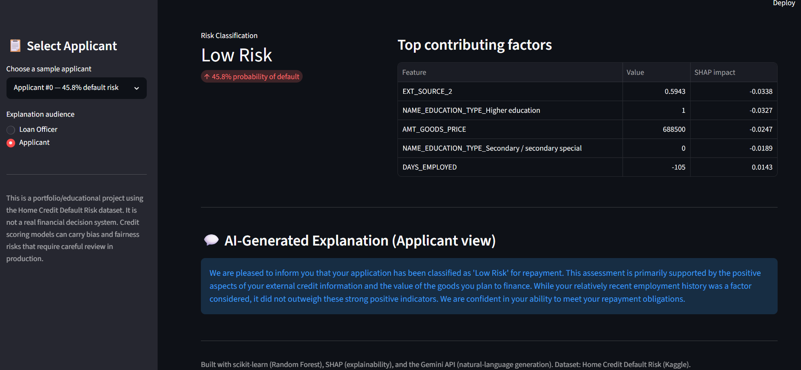
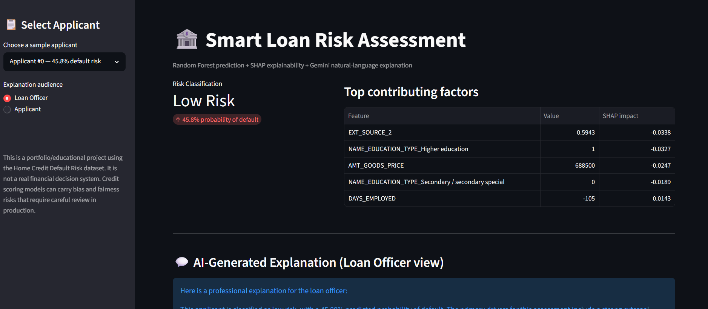

# Smart Loan Risk Assessment — ML + Generative AI Explainability

A credit risk prediction system that combines a traditional machine learning
model with a large language model (Gemini) to produce clear, human-readable
explanations for every prediction — tailored separately for loan officers and
for applicants.

> **Portfolio / educational project.** This is not a real financial decision
> system. See the [Responsible AI](#responsible-ai--fairness-considerations)
> section below for important caveats around bias and fairness.

---

## Why this project

Most credit risk models output a single number: a probability of default.
That number is not very useful on its own — a loan officer needs to know
*why* the model reached that conclusion, and an applicant deserves a plain-English
answer rather than a rejection with no explanation.

This project pairs a classic ML pipeline with two explainability layers:

1. **SHAP** — quantifies exactly which features pushed an individual
   applicant's risk score up or down.
2. **Gemini (LLM)** — translates those raw SHAP values into natural,
   audience-appropriate language, without technical jargon.

---

## Architecture

```
                    ┌─────────────────────┐
   Applicant data → │  Random Forest       │ → Risk prediction (0–1)
                    │  Classifier          │
                    └─────────┬────────────┘
                              │
                              ▼
                    ┌─────────────────────┐
                    │  SHAP TreeExplainer  │ → Top contributing features
                    │  (per-applicant)     │    + direction of impact
                    └─────────┬────────────┘
                              │
                              ▼
                    ┌─────────────────────┐
                    │  Gemini 2.5 Flash    │ → Natural-language explanation
                    │  (prompted, with     │    (loan officer / applicant
                    │   fairness rules)    │     tone)
                    └─────────────────────┘
```

---

## Dataset

[Home Credit Default Risk](https://www.kaggle.com/competitions/home-credit-default-risk)
(Kaggle competition dataset), ~307,000 loan applications with 122 features
covering demographics, income, employment, and existing credit history.

- **Target:** binary — did the applicant default on the loan (1) or repay it (0)?
- **Class balance:** ~92% repaid / ~8% defaulted — a realistic, heavily
  imbalanced classification problem.

The raw CSVs are not included in this repository (see `.gitignore`) due to
size. To reproduce this project, download the dataset from Kaggle and place
`application_train.csv` in a `data/` folder at the project root.

---

## Modeling approach

| Model | ROC-AUC |
|---|---|
| Decision Tree (baseline, `max_depth=6`) | 0.717 |
| **Random Forest** (`n_estimators=200`, `max_depth=10`) | **0.733** |

Both models used `class_weight='balanced'` to compensate for the ~8% minority
(default) class. Median imputation was used for missing numeric values, and
categorical variables were one-hot encoded.

**Classification report (Random Forest, threshold = 0.5):**

| Class | Precision | Recall | F1 |
|---|---|---|---|
| Repaid (0) | 0.96 | 0.71 | 0.81 |
| Default (1) | 0.16 | 0.64 | 0.26 |

The model prioritizes **recall on defaulters over precision** — a deliberate
effect of class balancing. In a lending context this reflects a real business
tradeoff: missing an actual defaulter (false negative) is typically costlier
than incorrectly flagging a safe applicant for review (false positive). This
threshold could be tuned further depending on an institution's risk appetite.

**Top predictive features** (Random Forest importances, confirmed independently
by SHAP): `EXT_SOURCE_1/2/3` (external credit bureau scores), applicant age,
length of employment, and loan/goods value.

---

## Explainability layer (SHAP)

For every applicant, `shap.TreeExplainer` produces per-feature contribution
values, which are converted into a simple structured format:

```python
{'feature': 'EXT_SOURCE_2', 'value': 0.594, 'effect': 'decreases risk', 'impact_score': 0.0338}
{'feature': 'DAYS_EMPLOYED', 'value': -105, 'effect': 'increases risk', 'impact_score': 0.0143}
```

This structured output is what gets passed to the LLM in the next step — the
model never sees raw applicant data, only the already-computed, ranked
contributing factors.

---

## AI-generated explanations (Gemini)

The top 5 SHAP factors for an applicant are converted into a prompt for
**Gemini 2.5 Flash**, which generates a short, plain-language explanation.
The same underlying data produces two different outputs depending on the
intended audience.

**Loan officer view** (Applicant #0, low risk, 45.80% predicted default probability):
> The model classifies this applicant as 'Low Risk' for default, predicting a
> 45.80% probability. This assessment is largely due to several strong
> positive factors, including a robust external credit indicator and a
> favorable education profile, specifically their higher education
> background. The substantial value of the goods being financed also
> significantly reduces the perceived risk. While their very recent
> employment history does increase the model's risk assessment, these
> stronger positive attributes collectively lead to the 'Low Risk'
> classification.

**Applicant view** (same applicant, empathetic and constructive tone):
> We are pleased to inform you that your application has been classified as
> 'Low Risk' for repayment. This assessment is primarily supported by the
> positive aspects of your external credit information and the value of the
> goods you plan to finance. While your relatively recent employment history
> was a factor considered, it did not outweigh these strong positive
> indicators. We are confident in your ability to meet your repayment
> obligations.

**Applicant view — high-risk example** (73.14% predicted default probability,
after the fairness constraint described below was added):
> Our review of your application suggests a higher likelihood of default,
> with the model estimating this at 73.14%. A significant factor contributing
> to this assessment is the information gathered from external credit
> sources, which indicates a credit profile that currently presents a higher
> risk. While our full assessment considers various aspects of your profile,
> we focus on financial and credit-related information in our feedback for
> fairness reasons. We encourage you to review your credit report and
> explore steps to strengthen your overall credit profile for future
> applications.

---

## Responsible AI / fairness considerations

This is the part of the project I'd consider most important, and the reason
I'd encourage anyone building something similar to look past the accuracy
number.

**What we found:** Early testing showed the model's SHAP explanations
sometimes surfaced **age**, **gender**, and **geographic/regional** features
among the top contributing factors for a prediction — and, before a
safeguard was added, the AI explanation repeated this directly to a
simulated applicant. For a high-risk applicant, the unmodified prompt
produced this (same applicant, same 73.14% prediction, same underlying
SHAP factors as the corrected example above):

> Based on our credit assessment model, your application has unfortunately
> been classified as having a high risk of default, with a predicted
> probability of 73.14%. This assessment is primarily influenced by several
> key factors: less favorable information from external credit sources,
> **certain aspects of your personal profile including your age
> (approximately 29 years old), and the credit risk profile associated with
> your residential area.** We understand this decision may be disappointing,
> and we encourage you to review your credit report for any inaccuracies...

Directly telling a 29-year-old applicant that their age counted against
them, and citing their neighborhood's "credit risk profile," are both
real-world compliance red flags described below.

**Why this matters:** In many jurisdictions, using age, gender, or
neighborhood/region as an explicit factor in a credit decision — or
disclosing it as a reason to the applicant — raises fair-lending and
anti-discrimination concerns (in the US, for example, under the Equal Credit
Opportunity Act). Geographic risk scoring in particular closely resembles
historical **redlining** practices.

**What was done about it:** The Gemini prompt was updated with an explicit
constraint instructing the model to never cite age, gender, education level,
or region as a justification, and to instead focus only on financial and
credit-history factors — while transparently noting that other (undisclosed)
factors were also considered. The before/after difference is a concrete,
testable example of prompt-level fairness mitigation in this repository's
notebook.

**What a production system would still need:** removing or auditing these
features at the model level (not just at the explanation layer), a formal
disparate-impact analysis, and legal/compliance review before any real-world
use. This project treats that as future work, not a solved problem.

---

## Demo screenshots

**Low-risk applicant — Applicant view:**


**Low-risk applicant — Loan officer view:**


## Interactive demo (Streamlit)

`app.py` provides two ways to explore the pipeline:

**1. Browse sample applicants** — select any applicant from the test set,
view their risk classification, top SHAP-driving factors, and toggle between
"Loan Officer" and "Applicant" explanation styles.

**2. Assess a new applicant** — a live form where you can enter an
applicant's financial details (income, loan amount, employment history,
education, etc.) and get a real-time prediction, computed on the fly with a
live SHAP explanation and Gemini-generated summary — not replayed from saved
data.

**An honest limitation of the "new applicant" form:** the model's three
strongest predictors (`EXT_SOURCE_1/2/3`) are external credit bureau scores,
not something an applicant would self-report. The form exposes them as
sliders for demonstration purposes, with a note in the UI that a real system
would fetch these from a credit bureau API rather than asking the user
directly. All fields not covered by the form are filled from a real
applicant's feature vector as a template, to keep the one-hot encoded
feature structure valid — this is a simplification appropriate for a
portfolio demo, not something a production system would do.

Run locally:

```bash
conda activate creditrisk   # or your preferred environment
pip install -r requirements.txt
streamlit run app.py
```

You will need your own Gemini API key (free from
[Google AI Studio](https://aistudio.google.com/)) in a `.env` file:

```
GOOGLE_API_KEY=your_key_here
```

---

## Tech stack

- **Python**, pandas, NumPy, scikit-learn (Decision Tree, Random Forest)
- **SHAP** for model explainability
- **Google Gen AI SDK** (`google-genai`) with Gemini 2.5 Flash for natural
  language generation
- **Streamlit** for the interactive demo
- **Matplotlib / Seaborn** for EDA and visualizations

---

## Project structure

```
Credit_Risk_Ai/
├── HomeRisk.ipynb          # EDA, model training, SHAP, Gemini prototyping
├── app.py                  # Streamlit demo app
├── requirements.txt
├── .env                    # API key (not committed)
├── .gitignore
├── data/                   # Home Credit dataset (not committed, see above)
└── models/                 # Saved model + SHAP artifacts (not committed)
```

---

## Possible next steps

- Enrich the model with aggregated features from `bureau.csv` (applicants'
  credit history at other institutions) and compare AUC uplift
- Threshold tuning / cost-sensitive evaluation for the precision-recall
  tradeoff described above
- Formal fairness audit (e.g., disparate impact ratio across demographic
  groups) rather than the prompt-level mitigation used here
- Deploy the Streamlit app publicly (Streamlit Community Cloud) with request
  caching to manage LLM API rate limits

---

## Disclaimer

This project uses a public Kaggle dataset for educational purposes only. It
is not intended for and should not be used to make real lending or credit
decisions.
